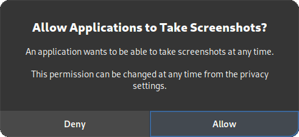

# Wayland Architecture

This page documents how PyAutoGUI2 works under Wayland, and provides setup
instructions for each supported compositor.

---

## How It Works

Wayland's security model is fundamentally more restrictive than X11: applications
cannot observe or inject input events globally. PyAutoGUI2 works around this with
a two-layer approach.

### Input injection — UInput

All keyboard and mouse events are injected via the **Linux UInput subsystem**,
which creates a virtual input device at the kernel level. This bypasses Wayland's
restrictions entirely, since the events appear to come from a physical device.

```
PyAutoGUI2 → python-uinput → /dev/uinput → kernel → Wayland compositor
```

This part is **compositor-agnostic**: it works the same regardless of which
compositor you run.

### Compositor queries

Three pieces of information cannot be obtained from UInput alone and require
querying the compositor directly:

| Information | Why it needs the compositor |
|---|---|
| Current pointer position | UInput is write-only — no position feedback |
| Screen size / monitor layout | Wayland has no global screen query API |
| Active keyboard layout | Layout is managed by the compositor, not the kernel, and `setxkbmap -query` does not always correspond to the real active layout |

Each supported compositor exposes this information through its own mechanism.
For example, GNOME Shell uses a dedicated shell extension communicating over
D-Bus. Other compositors may provide native APIs or protocols that make an
extension unnecessary.

### Screenshot capture — xdg-desktop-portal

Unlike X11, Wayland does not allow applications to capture the screen directly.
PyAutoGUI2 does **not** use [pyscreeze](https://github.com/asweigart/pyscreeze)
screenshot on Wayland. Instead, it uses the
[xdg-desktop-portal](https://flatpak.github.io/xdg-desktop-portal/) D-Bus API,
which provides a standardized, permission-gated screenshot interface supported
by all major Wayland compositors.

```
PyAutoGUI2 → xdg-desktop-portal → compositor screenshot API → PIL Image
```

The first time a screenshot is requested, the compositor displays a **one-time
authorization dialog** asking the user to grant screen capture permission to the
application. Once granted, the permission is remembered for the current session
— the dialog will not appear again.

> **Important:** If the user denies the permission, all features that rely on
> screenshots (screen capture, image-based location, pixel reading) will be
> unavailable. There is no fallback mechanism.

---

## Compositor Support

| Compositor | Desktop Environment | Typical Distributions | Status |
|---|---|---|---|
| GNOME Shell | GNOME | Ubuntu, Fedora, Debian, Pop!_OS | ✅ Supported |
| KWin | KDE Plasma | Kubuntu, Fedora KDE, openSUSE | 🔲 Planned |
| Muffin | Cinnamon | Linux Mint | 🔲 Planned |
| Marco | MATE | Linux Mint MATE, Ubuntu MATE | 🔲 Planned |
| wlroots-based | Sway, Hyprland, etc. | Arch, NixOS | 🔲 Planned |
| Xfwm | XFCE | Xubuntu, Linux Mint XFCE | 🔲 Planned |

---

## Setup

### UInput

UInput is required on all Wayland configurations, regardless of compositor.

**1. Install the kernel module and Python bindings**

```bash
sudo apt install python3-uinput        # Debian / Ubuntu / Mint
sudo dnf install python3-uinput        # Fedora
sudo pacman -S python-uinput           # Arch
```

**2. Load the kernel module**

```bash
# Load the uinput kernel module
sudo modprobe uinput

# Make it persistent across reboots
echo "uinput" | sudo tee /etc/modules-load.d/uinput.conf
```

**3. Grant access to `/dev/uinput`**

By default, `/dev/uinput` is only accessible to root. Add your user to the
`uinput` group:

```bash
sudo groupadd -f uinput
sudo usermod -aG uinput $USER
```

> **Log out and log back in** after adding yourself to the `uinput` group for the change to
> take effect.

**4. Add a udev rule**

Instead of relying solely on group membership, add a persistent udev rule:

```bash
echo 'KERNEL=="uinput", GROUP="uinput", MODE="0660"' \
  | sudo tee /etc/udev/rules.d/99-uinput.rules

# Reload udev rules
sudo udevadm control --reload-rules
sudo udevadm trigger
```

**5. Verify**

```bash
ls -la /dev/uinput
# Expected: crw-rw---- 1 root uinput ... /dev/uinput

groups $USER
# Expected: ... uinput ...
```

---

### GNOME Shell Extension

On GNOME Shell, PyAutoGUI2 uses a shell extension to expose pointer position,
screen layout, and keyboard layout over D-Bus.

**Supported versions:** GNOME Shell 45 and later.

**1. Install the extension**

```bash
pyautogui2-install-gnome-extension
```

This copies the extension files to `~/.local/share/gnome-shell/extensions/`.

**2. Enable the extension**

```bash
gnome-extensions enable gnome-wayland@pyautogui.org
```

Or via the GNOME Extensions app if you prefer a graphical interface.

**3. Restart GNOME Shell**

Press `Alt + F2`, type `r`, and press `Enter`.

> **Note:** On Wayland, restarting GNOME Shell requires logging out and back in
> on some distributions (notably Ubuntu 22.04+).

**4. Verify**

```bash
gdbus call \
  --session \
  --dest org.pyautogui.Wayland \
  --object-path /org/pyautogui/Wayland \
  --method org.pyautogui.Wayland.GetPosition
# Expected: (int32 ..., int32 ...)
```

---

### xdg-desktop-portal

`xdg-desktop-portal` is required on all Wayland configurations for screenshot
functionality. It must be installed along with the backend specific to your
compositor.

**Supported on:** all Wayland compositors listed in the [Compositor Support](#compositor-support) table.

**1. Install xdg-desktop-portal and the compositor-specific backend**

```bash
# GNOME Shell
sudo apt install xdg-desktop-portal xdg-desktop-portal-gnome   # Debian / Ubuntu / Mint
sudo dnf install xdg-desktop-portal xdg-desktop-portal-gnome   # Fedora
sudo pacman -S xdg-desktop-portal xdg-desktop-portal-gnome     # Arch

# KDE Plasma (when supported)
sudo apt install xdg-desktop-portal xdg-desktop-portal-kde
sudo dnf install xdg-desktop-portal xdg-desktop-portal-kde
sudo pacman -S xdg-desktop-portal xdg-desktop-portal-kde
```

> Install the backend that matches your compositor. Installing the wrong backend
> may result in the portal failing silently.

**2. Verify the portal is running**

```bash
gdbus call \
  --session \
  --dest org.freedesktop.portal.Desktop \
  --object-path /org/freedesktop/portal/desktop \
  --method org.freedesktop.DBus.Introspectable.Introspect
# Expected: a long XML string describing the portal interface
```

**3. Grant screen capture permission**

The first time PyAutoGUI2 takes a screenshot, the compositor will display an
authorization dialog:



Click **Allow** to grant permission. This dialog appears only once.

> **If you click Deny**, screenshot-based features will be unavailable.

---

## Known Limitations

**UInput requires kernel-level access**

Writing to `/dev/uinput` requires the `input` group membership or equivalent
permissions. This is a deliberate Linux security boundary — there is no way
around it without elevated privileges.

**GNOME Shell restart may require logout**

On Wayland sessions, GNOME Shell cannot be restarted in-place on some
distributions. If `Alt + F2 → r` does not work, log out and back in.

**Compositor version dependency**

The GNOME Shell extension targets GNOME Shell 45+. Older versions are not
supported. Check your version with:

```bash
gnome-shell --version
```

**Screenshot permission must be granted interactively**

On Wayland, screen capture requires explicit user authorization through the
compositor's portal dialog. This dialog appears once, at the first
screenshot request. There is no way to pre-grant this permission
programmatically or suppress the dialog (for security reasons).
Automated environments (CI, headless sessions) cannot use screenshot-based
features unless the compositor supports persistent portal tokens.

---

## Troubleshooting

**`PermissionError: /dev/uinput`**

Your user does not have write access to `/dev/uinput`.

```bash
# Check current permissions
ls -la /dev/uinput

# Check group membership
groups $USER

# If 'input' is missing, add yourself and re-login
sudo usermod -aG input $USER
```

---

**`ModuleNotFoundError: uinput`**

The `python-uinput` package is not installed. See [UInput setup](#uinput) above.

---

**`DBusException: org.freedesktop.DBus.Error.ServiceUnknown`**

The GNOME Shell extension is not running. Check that it is enabled and that
GNOME Shell has been restarted:

```bash
gnome-extensions list --enabled | grep pyautogui
```

If the extension does not appear, re-run the installation:

```bash
pyautogui2-install-gnome-extension
gnome-extensions enable gnome-wayland@pyautogui.org
```

---

**Pointer position always returns `(0, 0)`**

The extension is running but the D-Bus call is failing silently. Verify with
the `gdbus` command from the [verification step](#gnome-shell-extension) above.
If the call fails, check the GNOME Shell logs:

```bash
journalctl /usr/bin/gnome-shell -f
```

---

**Screenshot permission was denied**

If you clicked *Deny* in the authorization dialog, screenshot-based features
will fail. Go to Privacy settings to reset the permission
state and be prompted again.

If the dialog never appeared (portal not running), verify that
`xdg-desktop-portal` and the compositor-specific backend are installed and
running:

```bash
# Check that the portal service is active
systemctl --user status xdg-desktop-portal

# Check that the compositor backend is active (example: GNOME)
systemctl --user status xdg-desktop-portal-gnome
```

See [xdg-desktop-portal setup](#xdg-desktop-portal) for installation instructions.

---

**`org.freedesktop.portal.Screenshot` not available**

The installed portal backend does not support the Screenshot interface, or no
backend is installed for your compositor. Verify which backend is active:

```bash
systemctl --user list-units | grep xdg-desktop-portal
```

Install the backend matching your compositor (see [xdg-desktop-portal setup](#xdg-desktop-portal)).

---

## See Also

- [Linux Platform Guide](installation.md) — For platform overview and X11 setup
