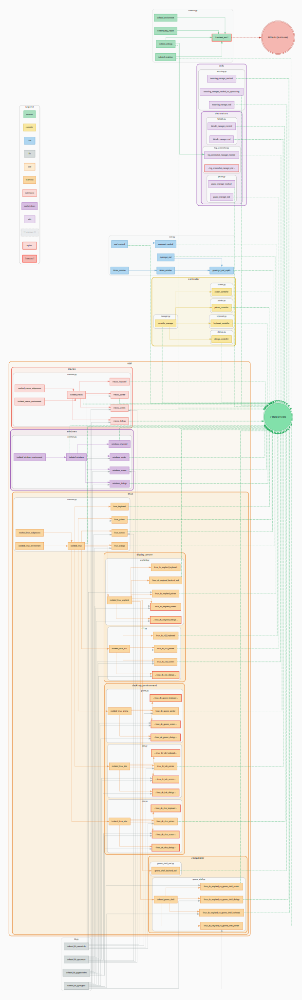

# Test Suite

This document describes the structure, conventions, and tooling of the PyAutoGUI2 test suite.
It is intended for contributors who want to understand, run, or extend the tests.

---

## 1. Overview

The test suite lives entirely under `tests/` and is built around three principles:

- **No real hardware access in unit tests.** All mouse, keyboard, screen, and dialog operations
  are intercepted by mocks. Tests never move the actual cursor or open real dialog boxes.
- **Isolation by default.** Each test runs in a clean environment. Global state (settings,
  platform detection, imported modules) is reset between tests via fixtures.
- **Real-system tests are opt-in.** A small set of integration tests tagged `@pytest.mark.real`
  interact with the actual OS. They are excluded from the default test run and from CI.

Coverage target is **100%** (branch coverage included).

---

## 2. Structure

```
tests/
├── conftest.py                        # Root conftest — loads all fixture modules
├── fixtures/                          # Pytest fixtures (no test functions here)
│   ├── common.py                      # Shared cross-platform fixtures
│   ├── core.py                        # PyAutoGUI core / singleton fixtures
│   ├── helpers.py                     # Platform detection helpers (is_linux(), …)
│   ├── lib.py                         # Mocks for third-party libs (pyscreeze, pymsgbox…)
│   ├── controller/                    # Fixtures for controller-level tests
│   │   ├── manager.py                 # ControllerManager fixture
│   │   ├── pointer.py
│   │   ├── keyboard.py
│   │   ├── screen.py
│   │   └── dialogs.py
│   ├── osal/                          # OS backend fixtures
│   │   ├── linux/
│   │   │   ├── common.py              # Shared Linux fixtures (isolated_linux, …)
│   │   │   ├── osal_builder.py        # Helper to assemble Linux OSAL instances
│   │   │   ├── compositor/
│   │   │   │   ├── gnome_shell.py
│   │   │   │   └── gnome_shell_real.py  # Real-system variant (@pytest.mark.real)
│   │   │   ├── desktop_environment/
│   │   │   │   ├── gnome.py
│   │   │   │   ├── kde.py
│   │   │   │   └── xfce.py
│   │   │   └── display_server/
│   │   │       ├── wayland.py
│   │   │       └── x11.py
│   │   ├── macos/
│   │   │   └── common.py
│   │   └── windows/
│   │       └── common.py
│   └── utils/                         # Fixtures for utility modules
│       ├── decorators/
│       │   ├── failsafe.py
│       │   ├── log_screenshot.py
│       │   └── pause.py
│       └── tweening.py
├── mocks/                             # Reusable fake objects (no test functions here)
│   ├── lib/                           # Fakes for third-party libraries
│   │   ├── mock_mouseinfo.py
│   │   ├── mock_pygetwindow.py
│   │   ├── mock_pymsgbox.py
│   │   ├── mock_pyscreeze.py
│   │   └── mock_pytweening.py
│   └── osal/                          # Fakes for OS backends
│       ├── generic/                   # Platform-agnostic OSAL mocks
│       │   ├── base.py
│       │   ├── mock_pointer_osal.py
│       │   ├── mock_keyboard_osal.py
│       │   ├── mock_screen_osal.py
│       │   └── mock_dialogs_osal.py
│       ├── linux/
│       │   ├── mock_backend_gnome_shell.py
│       │   ├── mock_dbus.py
│       │   ├── mock_parts.py
│       │   ├── mock_subprocess.py
│       │   ├── mock_uinput.py
│       │   └── mock_xlib.py
│       ├── macos/
│       │   ├── mock_appkit.py
│       │   ├── mock_launch_services.py
│       │   ├── mock_quartz.py
│       │   └── mock_subprocess.py
│       └── windows/
│           ├── mock_ctypes.py
│           ├── mock_kernel32.py
│           └── mock_user32.py
├── test_controllers/                  # Tests for the public API layer
│   ├── test_pointer.py
│   ├── test_keyboard.py
│   ├── test_screen.py
│   └── test_dialogs.py
├── test_osal/                         # Tests for OS backends
│   ├── linux/
│   ├── macos/
│   └── windows/
├── test_integration/                  # Real-system tests (opt-in, excluded from CI)
│   ├── test_installation_wayland_gnome_shell.py
│   └── …
└── test_utils/                        # Tests for internal utilities
    ├── test_types.py
    ├── test_exceptions.py
    └── …
```

**Rule of thumb:** `fixtures/` contains setup code, `mocks/` contains fake objects,
`test_*/` contains the actual test functions. Neither `fixtures/` nor `mocks/` should
contain any `test_` functions — pytest will not collect them, and mixing concerns
there causes confusion.

---

## 3. Running Tests

### Full suite (unit tests only)

```bash
pytest
```

### With coverage report

```bash
pytest --cov=pyautogui2 --cov-branch --cov-report=term-missing
```

### A specific module

```bash
pytest tests/test_controllers/test_keyboard.py
```

### A specific test class or function

```bash
pytest tests/test_controllers/test_keyboard.py::TestKeyboardWrite
pytest tests/test_controllers/test_keyboard.py::TestKeyboardWrite::test_write_simple
```

### Real-system tests (opt-in)

```bash
pytest -m real
```

> ⚠️ Real tests interact with actual mouse, keyboard, and screen.
> Run them only on a machine where side effects are acceptable.
> They are excluded from CI.

### Excluding real tests explicitly

```bash
pytest -m "not real"
```

---

## 4. Fixtures

Fixtures are defined in `tests/fixtures/` and loaded automatically via `conftest.py`.
They follow a layered pattern:

```
isolated environment (OS/lib mocking)
    └── backend instance (e.g. linux_pointer, macos_keyboard)
            └── controller instance (e.g. pyautogui_mocked)
```

Each layer builds on the previous one. For example, `macos_pointer` depends on
`isolated_macos`, which itself patches the MacOS-specific imports so no real
Quartz call is ever made.

**Key fixtures:**

| Fixture | Description |
|---|---|
| `pyautogui_mocked` | Full `PyAutoGUI` instance backed by generic mocks — use for controller tests |
| `isolated_linux` / `isolated_macos` / `isolated_windows` | Patches OS-level imports for backend tests |
| `isolated_lib_pyscreeze` | Replaces `pyscreeze` with a mock in `sys.modules` |
| `isolated_settings` | Resets all `PyAutoGUI` settings to defaults after each test |
| `controller_manager` | Provides individual controller instances without a full `PyAutoGUI` object |

### Fixture dependency graph

The diagram below shows all fixtures and their dependencies.
Edges point from dependency to dependent (A → B means "B requires A").



> To regenerate this diagram after adding or modifying fixtures, see [§ 7](#7-regenerating-the-fixture-graph).

---

## 5. Mocks

Mocks live in `tests/mocks/` and are plain Python classes — no magic, no auto-spec.
They implement only what the tests need, and raise `NotImplementedError` for anything
unexpected.

### Generic OSAL mocks

Located in `tests/mocks/osal/generic/`, these implement the OSAL interface with
`MagicMock`-backed methods so call assertions work out of the box:

```python
# Example: asserting that key_down was called
pyautogui_mocked.keyboard._osal.key_down.assert_called_once_with("shift")
```

Use these when testing **controllers** — you don't care about the OS backend,
only that the controller delegates correctly.

### Library mocks

Located in `tests/mocks/lib/`, these replace third-party libraries (`pyscreeze`,
`pymsgbox`, `pygetwindow`, `mouseinfo`) by injecting a fake module into `sys.modules`
via the `isolated_lib_*` fixtures.

This ensures that tests pass even when those libraries are not installed,
and prevents any real screen capture or dialog from appearing.

```python
def test_locate_delegates_to_pyscreeze(self, macos_screen, isolated_lib_pyscreeze):
    macos_screen.locate("button.png")
    isolated_lib_pyscreeze.locate.assert_called_once()
```

---

## 6. Adding Tests

### File placement

| What you're testing | Where to put the test |
|---|---|
| A controller method (`PointerController`, …) | `tests/test_controllers/` |
| An OSAL backend method (Linux/MacOS/Windows) | `tests/test_osal/<platform>/` |
| A utility function | `tests/test_utils/` |
| A real-system behavior | `tests/test_integration/` + `@pytest.mark.real` |

### Conventions

- **Class per feature**: group related tests in a `class Test<Feature>` — no module-level
  test functions.
- **Descriptive names**: `test_<method>_<condition>_<expected>` —
  e.g. `test_click_outside_screen_raises_failsafe`.
- **One assertion per test** (preferred) — or a tight logical group when unpacking
  a single result.
- **Use `pytest.mark.parametrize`** for input variation instead of loops inside tests.
- **Never rely on test execution order.** Each test must be fully self-contained.
- **No real I/O**: use the appropriate `isolated_*` fixture if your code touches
  the OS, filesystem, or a third-party library.

### Minimal example

```python
import pytest


class TestMyFeature:
    """Tests for MyFeature."""

    def test_something_returns_expected(self, pyautogui_mocked):
        """Verify that something() returns the expected value."""
        result = pyautogui_mocked.pointer.something()
        assert result == "expected"

    @pytest.mark.parametrize("value,expected", [
        (0, "zero"),
        (1, "one"),
    ])
    def test_something_parametrized(self, pyautogui_mocked, value, expected):
        """Verify parametrized behavior."""
        result = pyautogui_mocked.pointer.something(value)
        assert result == expected
```

---

## 7. Regenerating the Fixture Graph

The fixture dependency graph is generated by a standalone script:

```bash
python tests/dump_pytest_fixtures.py
```

This produces two files:

- `docs/tests/pytest_fixture_graph.dot` — the Graphviz source
- `docs/tests/pytest_fixture_graph.svg` — the rendered diagram (embedded in this page)

**When to regenerate:**

- After adding, renaming, or removing a fixture
- After changing fixture dependencies (parameters)

**Requirements:**

```bash
pip install graphviz
```

The system-level Graphviz binaries must also be installed:

```bash
# Debian/Ubuntu
sudo apt install graphviz

# MacOS
brew install graphviz

# Windows
winget install graphviz
```

> The generated `.dot` and `.svg` files are committed to the repository
> so that the diagram is always up to date in the docs without requiring
> contributors to install Graphviz locally.
